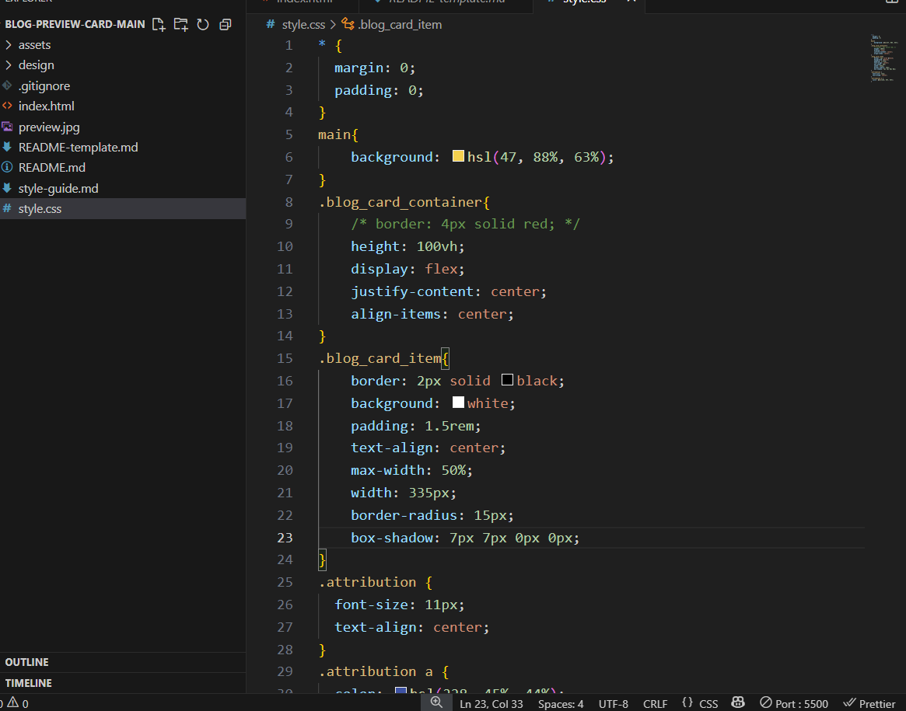
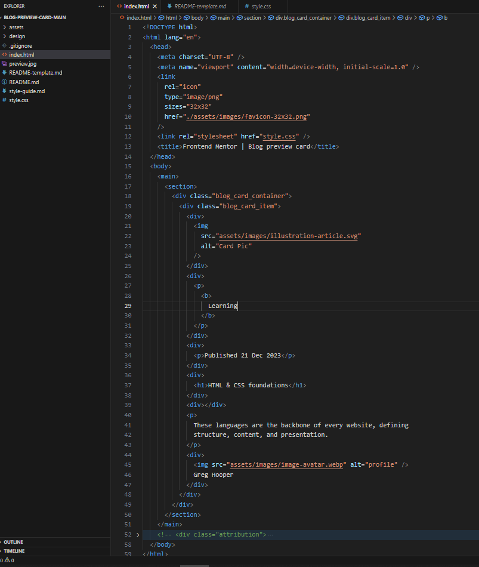
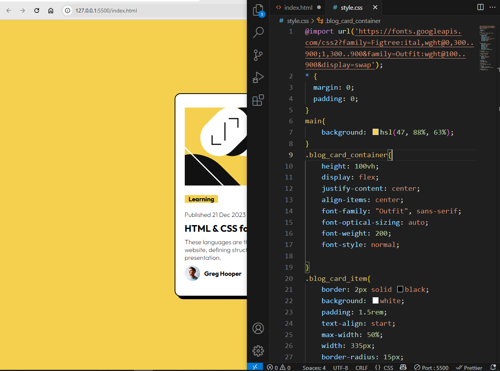
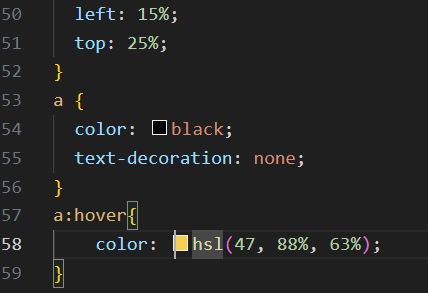
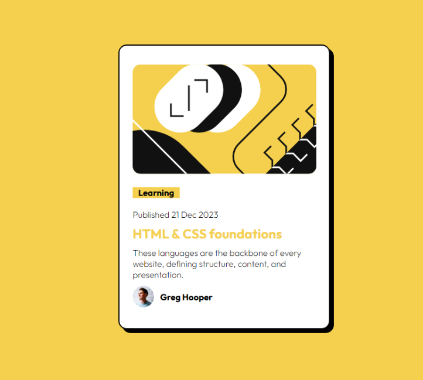

## Overview

- [Overview]

This is my second Challenge From Frontend Mentor Here i created my  blog card of a html and css foundation where i can further explore about html css like professionals this code is fully responsive with given design

## Screen Shot

- [Screenshot]

Here is my coding screen shot in my personal computer 
 

## Links

- [Links]

Live Site (https://frontendmentorchallenge-phi.vercel.app/2nd%20Challenge/index.html)

Git Repository Main Link (https://github.com/C1SLR/Frontend-Mentor-Challenges)

Git Repository Challenge Link (https://github.com/C1SLR/Frontend-Mentor-Challenges/tree/main/2nd%20Challenge)

## My process

- [My Process]

### Built with
- Semantic HTML5 markup
- CSS custom properties
- Flexbox

- [What_I_learned]

## What I Learned

In this Frontend Mentor's Challenge I Practised Flex Box And use css custom properties more deeply.

- [Continued_Development]

## Continued Development

I further excited to explore more challenges on frontend mentor and definitely recommend to all my web dev friends

- [Author]

## Author

- Frontend Mentor - [@C1SLR](https://www.frontendmentor.io/profile/C1SLR)