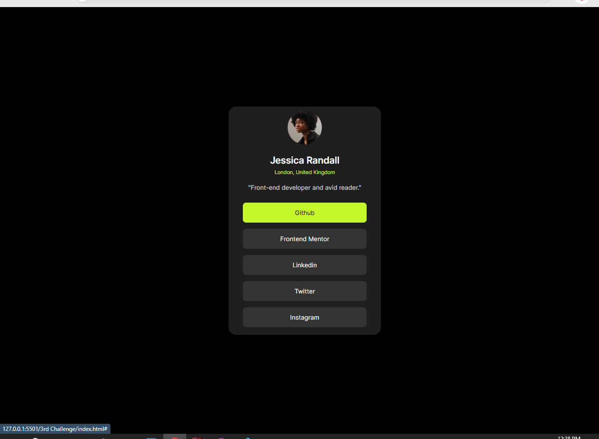
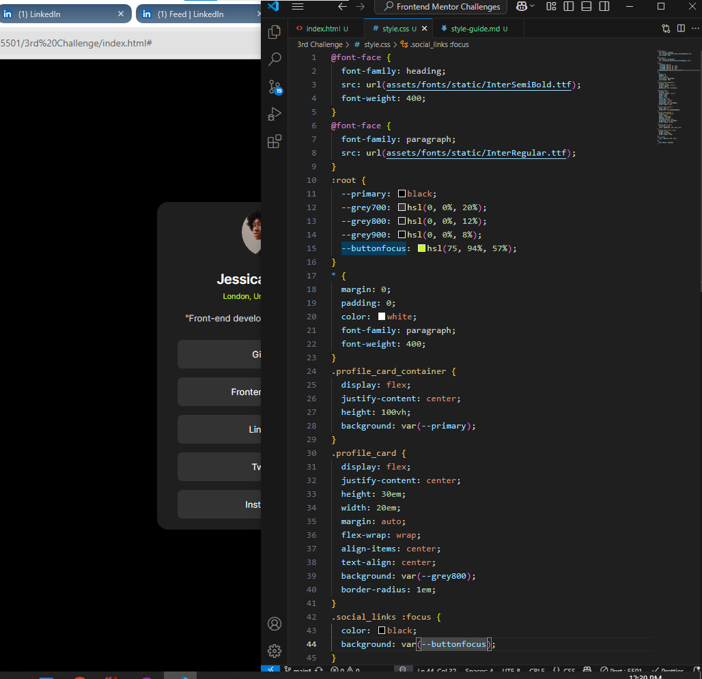
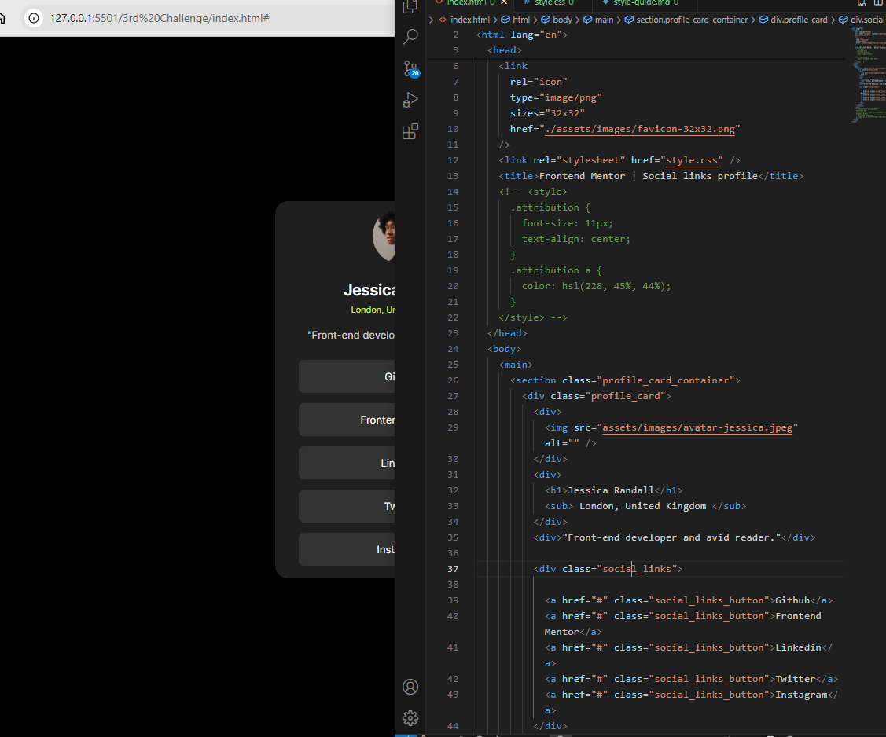

## Overview

- [Overview]

Another Challenge From Frontend Mentor where i'm creating social profile with the help of html and css exploring through Social links and profile are the best part to connect with communitiy

## Screen Shot

- [Screenshot]

Here is my coding screen shot in my personal computer 
 

## Links

- [Links]

Live Site (https://frontend-mentor-challenges-nine-mu.vercel.app)

Git Repository (https://github.com/C1SLR/Frontend-Mentor-Challenges)

## My process

- [My Process]

### Built with
- Semantic HTML5 markup
- CSS custom properties
- Flexbox
- Css Variables
- Local Fonts

- [What_I_learned]

## What I Learned

In this Frontend Mentor's Challenge I Learned About Making Responsive Pages Without using media querries plus without using px unit and learned the method of designing anchor tags

- [Continued_Development]

## Continued Development

As furthur learning progress i would like to say its compulsory to practise our code daily which is given by frontend mentor that's definitely appreciated ...!

- [Author]

## Author

- Frontend Mentor - [@C1SLR](https://www.frontendmentor.io/profile/C1SLR)