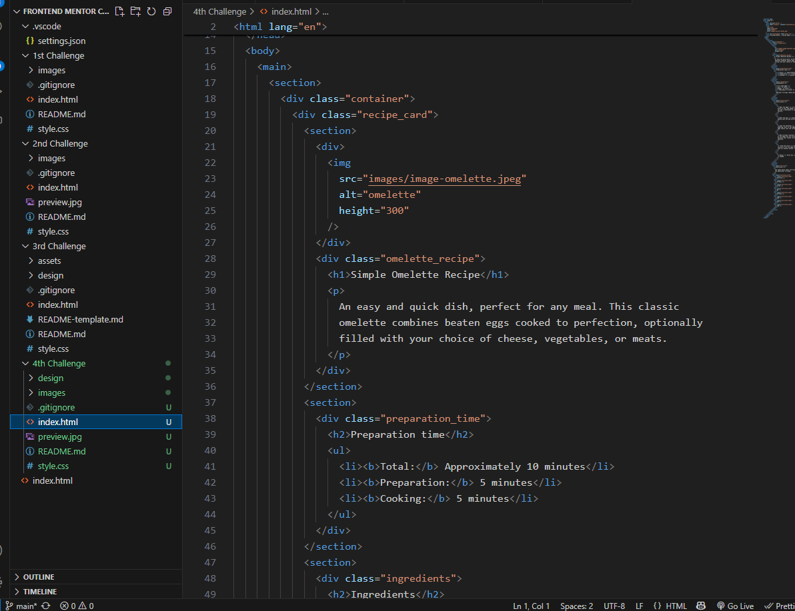
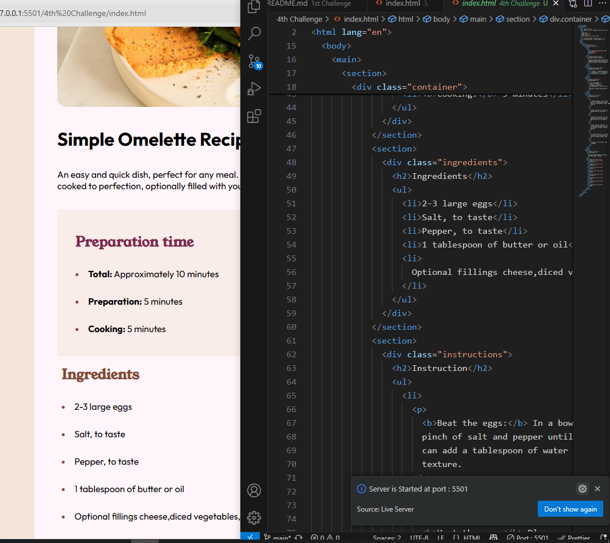
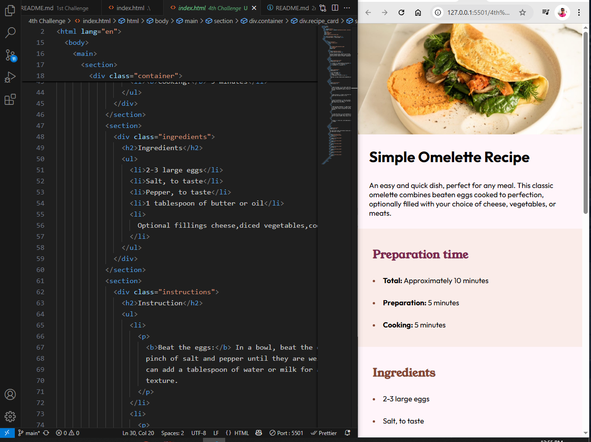
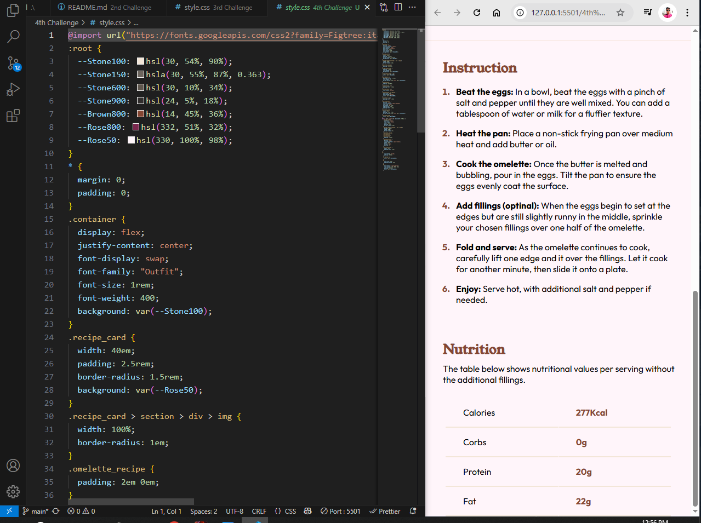

## Overview

- [Overview]

In this frontend mentors challenge we created a responsive cooking an omellete reciepe page which is great to understand designing and templates more deeply.

## Screen Shot

- [Screenshot]

 

## Links

- [Links]

Live Site ()

Git Repository Main Link (https://github.com/C1SLR/Frontend-Mentor-Challenges)

Git Repository Challenge Link ()

## My process

- [My Process]

### Built with
- Semantic HTML5 markup
- CSS Flexbox
- CSS Media Querries
- Css Variables
- CSS custom properties
- Google Fonts

- [What I learned]

## What I Learned

In the journey of my coding there is another topic i learned was how to code properly within semanticaly to css desigining a page responsive might be harder for beginer but after designing recipe page its not hard for me.

- [Continued Development]

## Continued Development

In future maybe i used frameworks of css for faster web page designing and progress like bootstrap tailwind CSS.

- [Author]

## Author

- Frontend Mentor - [@C1SLR](https://www.frontendmentor.io/profile/C1SLR)