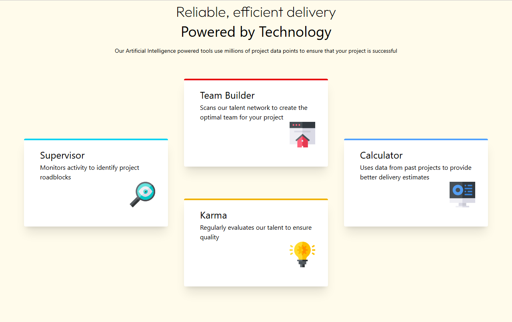
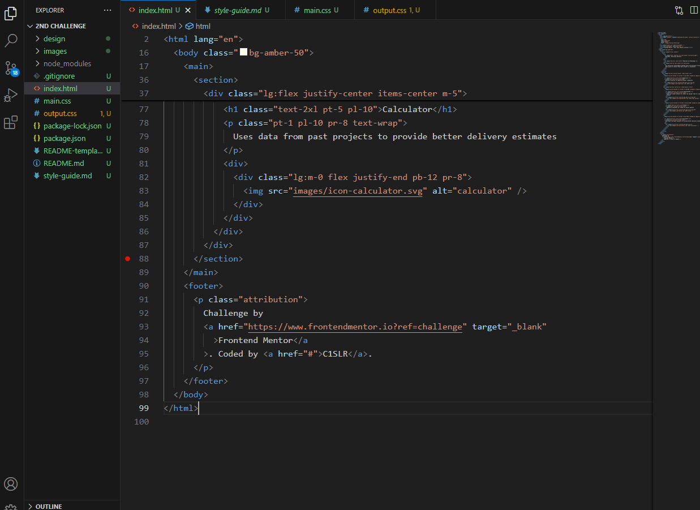

## Table of contents

- [Overview](#overview)
  - [Screenshot](#screenshot)
  - [Links](#links)
- [My process](#my-process)
  - [Built with](#built-with)
  - [What I learned](#what-i-learned)
  - [Continued development](#continued-development)
- [Author](#author)

## Overview

- [Overview]

This is an E-commerce page product of perfume with discounted price with fully responsiveness in mobile and desktop design.

## Screen Shot

- [Screenshot]

## Links

- [Links]

Live Site (https://frontendmentorchallenge-phi.vercel.app/Building%20Responsive%20Layouts/2nd%20Challenge/index.html)

Git Repository Main Link (https://github.com/C1SLR/Frontend-Mentor-Challenges)

Git Repository Challenge Link (https://github.com/C1SLR/Frontend-Mentor-Challenges/tree/main/Building%20Responsive%20Layouts/2nd%20Challenge)

## My process

- [My Process]

### Built with
- Semantic HTML5 markup
- Tailwind CSS
- Node Modules
- Html And Css
- CSS custom properties
- Google Fonts

## What I Learned

- [What I learned]

After many days of learning about the frame work tailwindcss i finally come to the good results of this beautiful page design which was given by frontend mentor

## Continued Development

- [Continued Development]

as my further learning of web dev that crucial point has been done for me was tailwind css now from today i am thinking about java script to learn!

## Author

- [Author]

- Frontend Mentor - [@C1SLR](https://www.frontendmentor.io/profile/C1SLR)