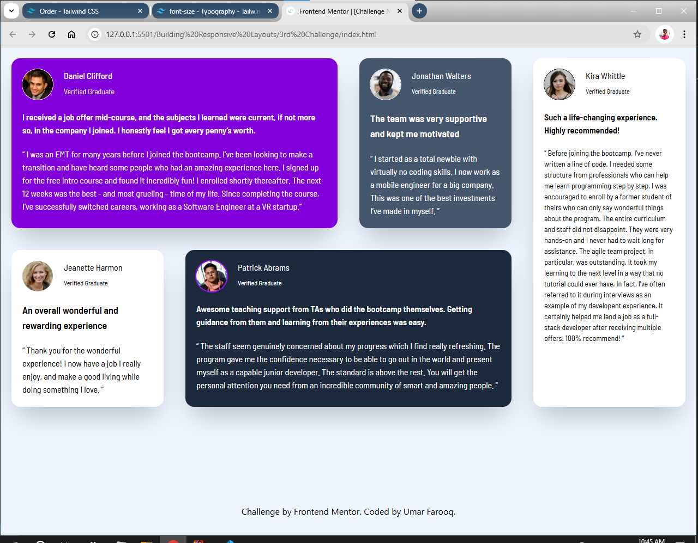
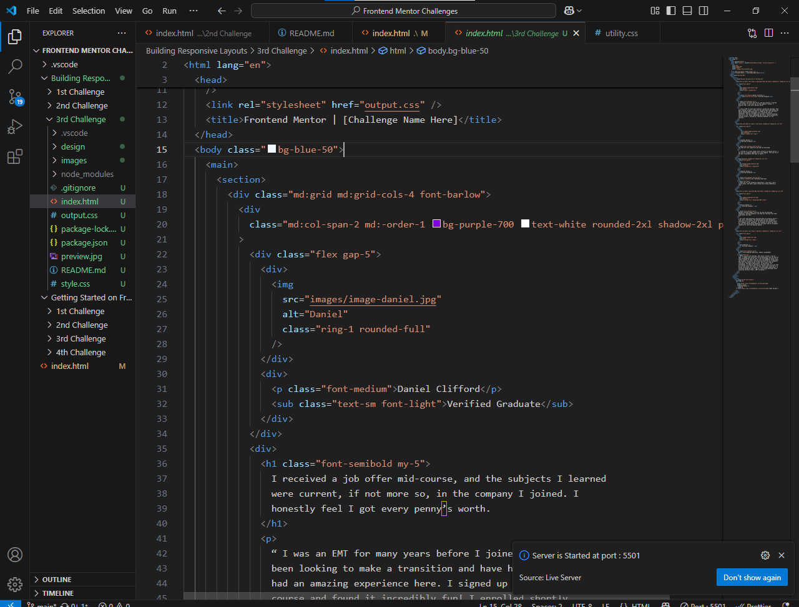

## Table of contents

- [Overview](#overview)
  - [Screenshot](#screenshot)
  - [Links](#links)
- [My process](#my-process)
  - [Built with](#built-with)
  - [What I learned](#what-i-learned)
  - [Continued development](#continued-development)
- [Author](#author)

## Overview

- [Overview]

Design of A Services reviews from some of our clients and Employees 

## Screen Shot

- [Screenshot]

## Links

- [Links]

Live Site (https://frontendmentorchallenge-phi.vercel.app/Building%20Responsive%20Layouts/3rd%20Challenge/index.html)

Git Repository Main Link (https://github.com/C1SLR/Frontend-Mentor-Challenges)

Git Repository Challenge Link (https://github.com/C1SLR/Frontend-Mentor-Challenges/tree/main/Building%20Responsive%20Layouts/3rd%20Challenge)

## My process

- [My Process]

### Built with
- Semantic HTML5 markup
- Tailwind CSS
- Node Modules
- Html And Css
- Tailwind Grid
- Google Fonts

## What I Learned

- [What I learned]

In this solution i learned about tailwind css and their grid systems

## Continued Development

- [Continued Development]

for further improvements i should keep practicing my learned components in tailwind css

## Author

- [Author]

- Frontend Mentor - [@C1SLR](https://www.frontendmentor.io/profile/C1SLR)