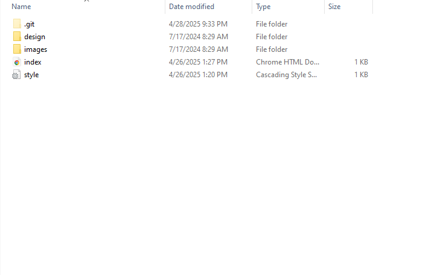
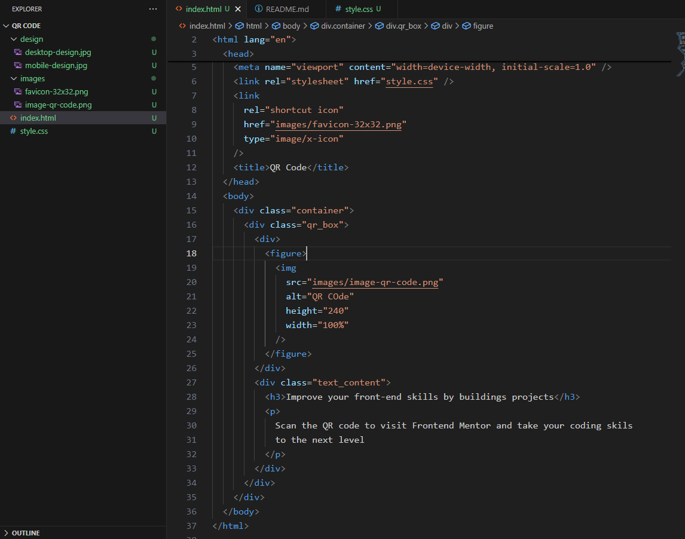
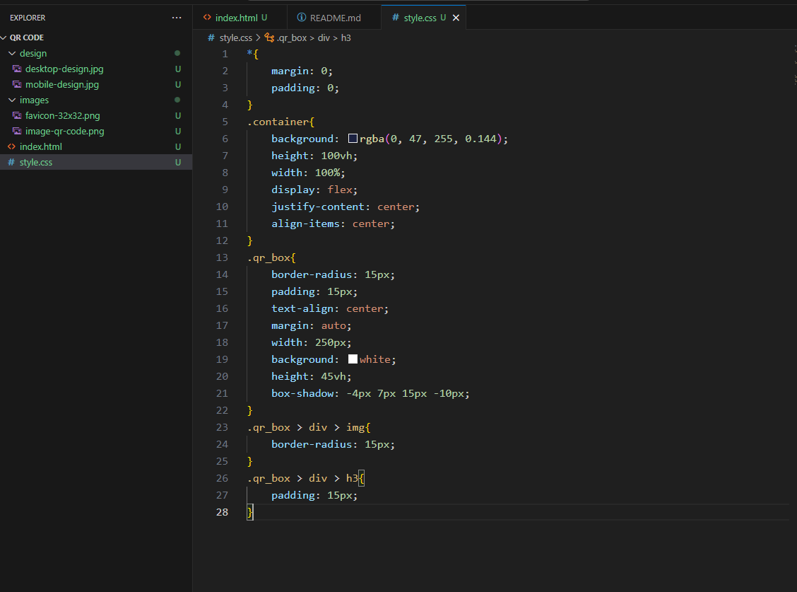

## Overview

- [Overview]

This is my first Challenge From Frontend Mentor Here i created my QR code page where i can scan QR code with fully responsive design

## Screen Shot

- [Screenshot]

Here is my coding screen shot in my personal computer  

## Links

- [Links]

Live Site
Git Repository

## My process

- [My Process]

### Built with
- Semantic HTML5 markup
- CSS custom properties
- Flexbox

- [What_I_learned]

## What I Learned

In this Frontend Mentor's First Challenge I Learned Basic Concepts of Flex Box And Also Know about how to center a div 

- [Continued_Development]

## Continued Development

In my future coding its compulsory to use flex box in CSS so need more further practise to clear the basic concepts

- [Author]

## Author

- Frontend Mentor - [@C1SLR](https://www.frontendmentor.io/profile/C1SLR)